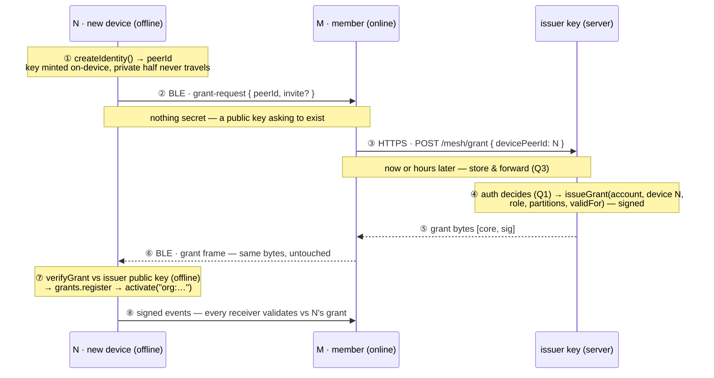
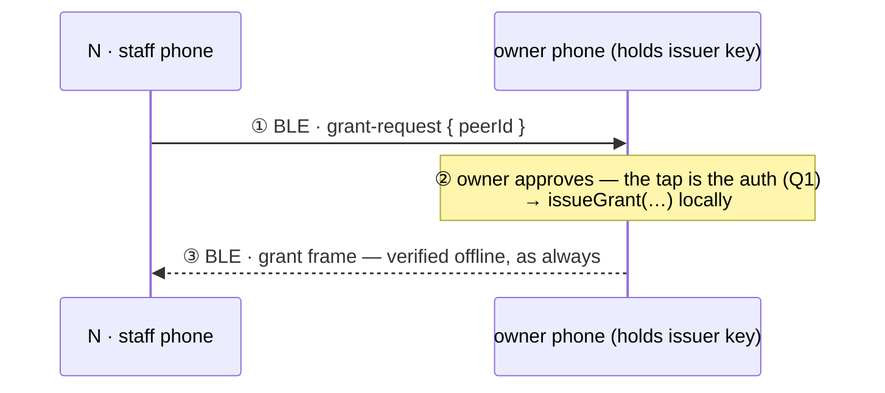
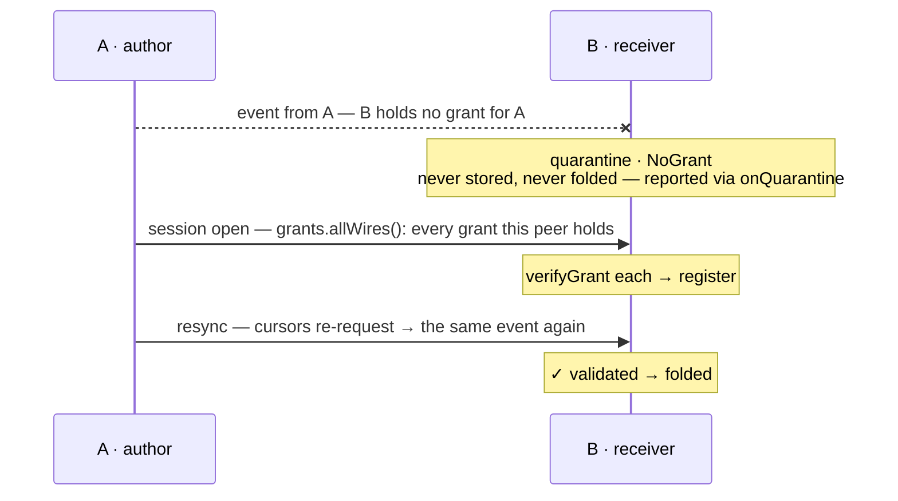

# Grant flows — how a device with no internet gets its permissions

A grant is ~100 bytes of signed CBOR binding **account + device key + role + partitions +
validity**, verified offline against the issuer's public key. So "how does N check a
permission?" is never a network question — that's local. The only question is **how the bytes
travel**, and bytes travel over anything, including another phone's radio.

Status legend: **built** = runs today (pinned in `packages/client/src/__tests__/onboarding.test.ts`) ·
**e11** = becomes a frame in E11 · **open** = Q1–Q5 below, to decide.

---

## Flow A — relayed onboarding: N is offline, M carries the bytes

N = new staff phone, no internet, no account. M = colleague's phone, granted, online.
M is a **courier, not an authority**.

| step | where · when | how | why it works | status |
|---|---|---|---|---|
| ① | N · first launch | `createIdentity(seed)` | D08-A: the device's Ed25519 key **is** its peer id. No server to mint one; the private key never leaves N. | built |
| ② | N → M · in range | `grant-request { peerId }` | Carries only a public key — safe to hand to anyone, relay through anyone. What proves the *account* is Q1/Q2. | e11 |
| ③ | M → issuer · when M online | `POST /mesh/grant { devicePeerId }` | The use-cases §1 route unchanged — it already takes a peerId in the body. M isn't trusted; it moves the question. | built |
| ④ | issuer · on request | `issueGrant(issuer, { account, device, role, partitions, validFor })` | The **only** privileged step. Whoever holds the issuer key decides who joins. Signing binds the grant to N's key: stolen bytes are useless. | built |
| ⑤⑥ | issuer → M → N | grant frame, bytes verbatim | Bytes are bytes: HTTPS then BLE then anything. Same `[core, sig]` envelope events use (E07). | e11 |
| ⑦ | N · on receipt | `grants.register(wire)` → `activate` | D08-A: verification is local — issuer public key from `createMesh` config + a clock. No round-trip ever again. | built |
| ⑧ | N ⇄ mesh · from then on | signed events | E06/E07: every peer validates N's events against N's grant (grants travel first — flow C). | built |

### A′ — what the courier can and cannot do

Each row is a pinned test, not an intention.

| M tries to… | verdict | why |
|---|---|---|
| forge a grant | **impossible** | no issuer key; invented bytes fail `BadGrantSignature` at N |
| alter role / partitions / expiry | **impossible** | the signature covers every field; one flipped byte → `MalformedGrant` |
| redirect the grant to itself | **impossible** | the grant names N's device key; M registering it answers for N's key — `can()` stays false on M |
| read the grant | allowed, harmless | grants are capabilities, not secrets; nothing in one lets a reader act |
| delay or drop | possible | the only real power: denial. N retries via any other online peer — no courier is special |

---

## Flow B — serverless org: the issuer key lives on a phone

Flow A minus the internet. `issueGrant` is a pure function over an `Identity` — the engine
doesn't know whether the keypair sits in a cloud route or on the owner's phone. Steps ③–⑤
collapse into one local mint; the room is the infrastructure.

---

## Flow C — grants travel first: the transport's one ordering job

Every session opens by exchanging grant frames **before** any event. When an event outruns
its grant anyway, the receiver refuses safely and recovers — never trusts, never loses.

Quarantine is refusal without loss: cursors re-request what was refused once the grant lands.
Note the relay property: B can hold and forward a grant for an author it has **never met**.

---

## The five open decisions (this is the discussion)

Everything above is built or a straightforward E11 frame. These change step ② or ④, nothing else.

**Q1 · Who says yes at step ④ — what authenticates the *account*?** The flow proves N's
device key, not that N is Ada rather than a stranger in BLE range. Options:
- **Invite token** — org pre-issues a one-time code (QR on M's screen, printed); N includes it
  in the request; the issuer redeems token → account. Offline-friendly, auditable.
- **Owner approval** — the request surfaces on an admin device ("Ada's phone wants to join as
  member — approve?"). The tap is the auth. Natural fit for flow B.
- **Existing credentials** — N encrypts its password/session to the issuer's public key inside
  the request. Reuses auth, but puts secrets in the relayed payload.

**Q2 · What rides in the grant-request frame?** Minimum `{ peerId }`. Candidates: invite token
(Q1), requested role, display name for the approval screen. Every field is attacker-writable —
the frame is unauthenticated — so nothing in it may be trusted, only forwarded.

**Q3 · Store & forward — does M queue when M is offline too?** If requests queue on any peer
and drain when *anyone* reaches the issuer, onboarding survives a fully dark room. Costs: TTL,
retry policy, dedup by peerId at the issuer.

**Q4 · Renewal — same flow, earlier?** Expiry is the staleness bound (D08). A device near
expiry sends a renewal request through any online peer — flow A with "new account" replaced by
"same account, fresh validity". Proactive between peers, or only when asked?

**Q5 · Second device, same account — who vouches?** Ada's laptop joins: her granted phone
requests a grant *for the laptop's peerId* under her account — the phone's existing issuer
session is the auth. No invite, no approval; needs only an app-level "link device" screen.

---

Refs: D07 (partitions), D08 (grants/expiry), E07 (grant wire + registry), E11 (frames,
`grant-request` task), `plan/use-cases.md` §5, `packages/client/src/__tests__/onboarding.test.ts`.
